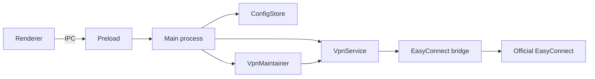

# EasyConnect Workbench VPN-only 重构设计

- 日期：2026-07-10
- 状态：已批准（用户授权工程负责人直接决策）
- 分支：`refactor/easyconnect-vpn-only`
- 基线：`e385631d4cc9d3d0501051d9607a7df69b831508`

## 1. 目标

EasyConnect Workbench 只承担两件事：

1. 在用户已有合法账号和官方 EasyConnect 客户端的前提下自动登录或恢复连接。
2. 在允许时段内持续检查连接，并在掉线时自动恢复。

主窗口不是综合工作台，也不是调试面板。它必须让用户在几秒内确认：

- VPN 是否在线；
- 自动守护是否运行；
- 最近一次检查或恢复发生了什么；
- 当前是否需要人工处理。

## 2. 产品边界

### 2.1 保留

- EasyConnect 自动登录和恢复链；
- 在线状态、session、service state 和官方 UI 一致性检查；
- keepalive、自动启动、登录项和 quiet hours；
- VPN 凭据、网关、客户端路径和守护间隔配置；
- 托盘常驻、托盘状态和常用动作；
- 必要的故障分类、活动记录、日志和配置目录入口；
- 安全的官方 UI 修复与高级诊断入口。

### 2.2 删除

- 构建站、发版站和发布流程；
- 平台账号、平台密码和平台 API 配置；
- 平台 API client、IPC、preload 暴露、renderer 页面与测试；
- 平台 API 捕获脚本和旧平台 UI 原型；
- 页面中所有“综合工作台”“Adapters”“构建/发版探测”表述。

### 2.3 不扩展

- 不重写 `src/easyconnect-bridge/`；
- 不增加账号体系、多人协作、云端同步或发布能力；
- 不把原始 JSON 当作默认用户界面；
- 不把异常恢复实现细节暴露为主流程概念。

## 3. 方案比较

### 方案 A：保留侧栏的传统 Dashboard

优点是改动较小，运行诊断和设置容易分区。缺点是产品只有两个核心目标，侧栏和多页面会继续放大信息架构，最小窗口也会重复当前“导航占满首屏”的问题。

### 方案 B：无侧栏的一屏状态中心

顶部只保留品牌、概览/活动切换、刷新和设置。概览页先显示唯一主状态和上下文动作，再显示守护状态、连接详情和最近活动。设置使用右侧抽屉，高级诊断放在活动页末尾。

这是最终方案。它最符合后台工具的使用频率，也能在不牺牲诊断能力的前提下降低默认信息密度。

### 方案 C：只做菜单栏 Popover

优点是最轻。缺点是首次配置、复杂失败解释和真实恢复验收空间不足；仍然需要独立窗口，最终会形成两套界面。

## 4. 信息架构

```text
EasyConnect Workbench
├── 概览
│   ├── 当前连接状态
│   ├── 上下文主动作
│   ├── 自动守护状态
│   ├── 连接详情
│   └── 最近活动
├── 活动
│   ├── 结构化事件列表
│   ├── 失败详情
│   └── 高级诊断（折叠）
└── 设置抽屉
    ├── 账号与网关
    ├── 自动守护与 quiet hours
    ├── macOS 登录项
    └── 客户端路径与本地目录
```

托盘继续作为后台入口，菜单只显示状态、打开主窗口、立即检查、启动/停止守护、打开日志和退出。

## 5. 主窗口设计

### 5.1 窗口

- 默认尺寸：`1040 x 720`；
- 最小尺寸：`900 x 640`；
- 顶部工具栏固定，内容区独立滚动；
- 不在桌面窗口宽度内切换成占满首屏的纵向导航；
- 浏览器级窄屏预览允许单列，但 Electron 最小宽度保证主流程稳定。

### 5.2 顶部工具栏

- 左侧：EasyConnect Workbench 品牌和简短状态点；
- 中部：`概览` / `活动` 分段控制；
- 右侧：设置图标；状态刷新由连接状态带中的上下文主动作承担；
- 图标使用 Lucide，所有图标按钮有 `aria-label` 和 tooltip；
- 不放说明文案、英文 eyebrow 或产品口号。

### 5.3 连接状态带

连接状态是首屏最强信号，但不使用 hero 尺寸。

- 在线：`已连接`，绿色状态标识；
- 离线：`连接已断开`，红色状态标识；
- 恢复中：`正在恢复连接`，进度标识；
- quiet hours：`静默时段`，琥珀色状态标识；
- 需要验证码或人工处理：`需要人工登录`，琥珀色状态标识；
- 同账号互踢：`账号在其他设备登录`，红色状态标识。

状态带同时显示当前网关、最近检查时间和守护状态。只显示一个上下文主动作：

| 状态 | 主动作 |
| --- | --- |
| 在线 | 立即检查 |
| 离线 | 立即连接 |
| 恢复中 | 无，保持禁用状态 |
| quiet hours | 立即检查，不自动恢复 |
| 验证码/人工处理 | 打开官方客户端 |
| 同账号互踢 | 打开官方客户端 |

`强制重新恢复`、`只恢复客户端`、`登录页注入`不出现在默认界面。

### 5.4 自动守护区

- 显示运行/停止/静默三个状态；
- 显示检查间隔、下一次检查或 quiet hours 结束时间；
- 提供启动或停止守护的直接命令；
- `启动应用时自动守护`、守护间隔和 quiet hours 配置进入设置抽屉；
- quiet hours 默认保持 `18:30-09:00`，界面初始化不得绕过主进程的 quiet-hours gate。

### 5.5 连接详情区

默认只显示可判断连接健康的字段：

- 当前网关；
- 登录账号；
- service health；
- session 摘要；
- 官方界面状态。

字段使用紧凑定义列表，不使用四张指标卡。session 只显示脱敏摘要。

### 5.6 最近活动

概览只显示最近三条结构化活动：时间、动作、结果、必要的错误摘要。点击“查看全部”进入活动页。

活动页保留最多 50 条当前窗口会话事件。原始对象放在每条记录的可展开详情中，不默认展示整块 JSON。

### 5.7 设置抽屉

设置从右侧进入，宽度固定在 `380px` 到 `440px`，不会形成嵌套卡片。

分组如下：

1. 账号：用户名、密码与显示/隐藏按钮；
2. 网关：允许网关列表；
3. 自动守护：启动时启用、间隔、quiet hours 开关和起止时间；
4. 系统：登录 macOS 时启动；
5. 高级：调试端口和 EasyConnect 路径；
6. 本地数据：打开日志目录、打开配置目录。

保存成功后抽屉保持打开并显示内联结果；失败时错误靠近保存动作，不使用遮挡内容的固定 toast。

### 5.8 高级诊断

高级诊断位于活动页底部的折叠区域：

- 修复官方界面；
- 拉起官方客户端；
- 探测恢复链路；
- 查看调试目标；
- 原始运行态、恢复计划和网关预检。

危险或低频动作必须带明确动词，执行中禁止重复点击。

## 6. 视觉系统

方向：安静、实用、接近 macOS 系统网络工具，但保留独立产品识别。

- 背景：冷中性浅灰；
- 表面：白色或极浅灰；
- 文字：近黑绿色；
- 在线：绿色；
- quiet hours/需处理：琥珀色；
- 离线/失败：红色；
- 链接与次级动作：克制蓝色；
- 不使用渐变、光斑、网格装饰或单色蓝主题；
- 圆角上限 `8px`，面板主要依靠 1px 分隔线；
- 标题使用 `Avenir Next`，正文使用 macOS 系统字体，技术值使用 `SF Mono`；
- 字号不随 viewport 宽度缩放；
- 所有 letter spacing 为 `0`；
- 状态不能只依赖颜色，必须同时有图标和文本；
- 按钮尺寸固定，动态文案不改变布局。

## 7. 组件边界

### Renderer

- `PAGE_META` 缩减为 `overview` 和 `activity`；
- `collectConfig` / `applyConfig` 只处理 `app` 和 `vpn`；
- 状态渲染、活动渲染、设置抽屉和动作反馈分别使用小函数；
- renderer 不拥有自动启动策略，只读取状态并触发明确用户动作；
- 不保留平台列表、平台凭据和 API 原始结果 helper。

### Preload

只暴露配置、VPN、守护和本地目录 API。删除平台 IPC facade。

### Main process

- 保留 `VpnService`、`VpnMaintainer`、`maybeStartMaintainerAutoStart` 和托盘；
- 删除平台 client import 和 `platform:*` handlers；
- 主进程继续拥有自动启动、quiet hours 和敏感能力；
- BrowserWindow 改为新的稳定尺寸与中性背景色。

### ConfigStore

- 默认配置只含 `app` 和 `vpn`；
- 读取旧配置时忽略 `portals`；
- 下一次保存后自然移除旧平台凭据；
- 不新增 fallback 字段隐藏配置缺口。

## 8. 数据流



初始加载：

1. renderer 读取配置、VPN snapshot 和 maintainer status；
2. 主进程负责启动时自动守护与 quiet-hours gate；
3. renderer 合并为视图状态并显示唯一主动作；
4. 后续 silent refresh 只更新状态，不产生成功提示或焦点变化。

## 9. 错误处理

- 所有 IPC 动作使用统一 timeout 和 busy 状态；
- 错误优先映射为用户可判断的状态，不直接展示堆栈；
- 详细错误进入活动项的展开区和日志；
- 恢复失败后保留最后成功状态、候选网关和失败阶段；
- captcha、private kick、local service not ready 和 agent proxy not ready 保持现有停止/退避语义；
- UI 修复失败不能覆盖真实 VPN 在线结论；
- renderer 初始化失败时仍能打开设置、日志和配置目录。

## 10. 测试策略

### TDD 产品边界

先新增失败测试，约束：

- 产品源码、HTML、preload、main、配置和 package test 列表中不再出现平台入口；
- `src/services/platform-api-client.js`、平台测试和捕获脚本被删除；
- 默认配置没有 `portals`，旧 `portals` 输入被忽略；
- 新 UI 必须包含 overview、activity、settings drawer、状态主动作和 quiet-hours 控件；
- 旧 build/release DOM id 和 IPC 不存在。

### 回归

- 现有 VPN service、maintainer、autostart、status label、gateway 和 bridge 测试全部通过；
- `npm test`；
- `npm run build:css`；
- `npm run smoke:app-lifecycle`；
- `npm run smoke:app-hidden-start`；
- `npm run package:mac`；
- `npm run smoke:packaged-app-lifecycle`。

### 视觉与交互

- 用 Playwright stub preload 状态，不启动 Electron 主进程；
- 截图并检查 `1040x720`、`900x640` 和窄屏浏览器预览；
- 验证无空白画面、重叠、截断、溢出或动态布局跳动；
- 验证 overview/activity、设置抽屉、密码显示、折叠诊断、busy/disabled 和错误状态；
- 检查控制台无未预期错误。

## 11. 最终功能验收

用户已授权受控断线恢复验收。顺序固定：

1. 记录 Workbench、EasyConnect、`CSClient`、`svpnservice` PID、当前 session、网关和配置 hash；
2. 运行非破坏性在线 snapshot 和 packaged lifecycle；
3. 安装或启动新的 Workbench 产物；
4. 确认当前不在 quiet hours 后，受控断开官方 EasyConnect 核心连接；
5. 验证 Workbench 自动检测离线并执行真实恢复，首轮动作不能是 `already-online`；
6. 验证新 session 在线、service state 健康、官方 UI 一致、配置未被污染；
7. 验证 quiet hours、托盘常驻、窗口隐藏和 CPU 空闲；
8. 失败时停止继续扰动，优先恢复连接并记录具体 blocker。

验收成功必须同时满足代码测试、打包、真实恢复和 UI 视觉检查，不能用单一 screenshot、HTTP 200 或 compile 代替。

## 12. 交付与回退

- 原始参考：`main@e385631`，保持不动；
- 重构提交只存在 `refactor/easyconnect-vpn-only` worktree；
- 删除能力与 UI 重构分成可审查的独立提交；
- 不 push，除非用户后续明确要求；
- 任意时刻可通过原目录 `main` 启动参考版本，或比较 `e385631..refactor/easyconnect-vpn-only`。
